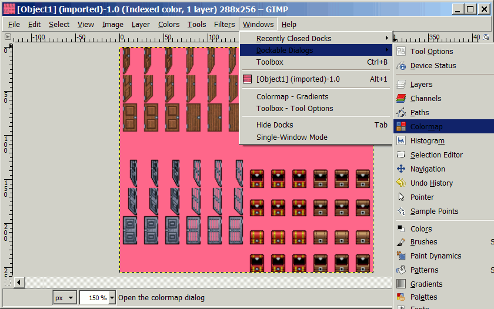
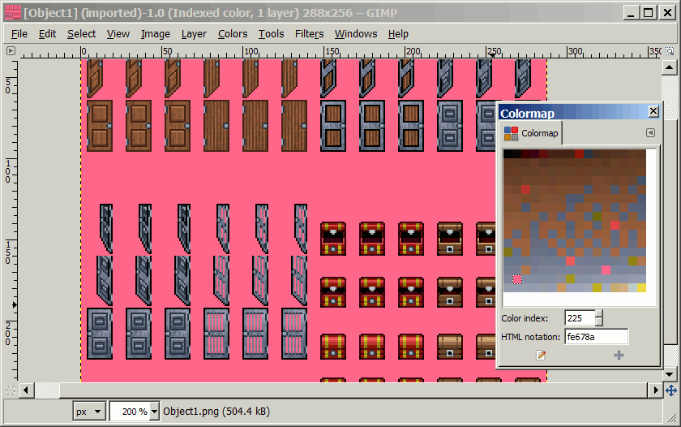
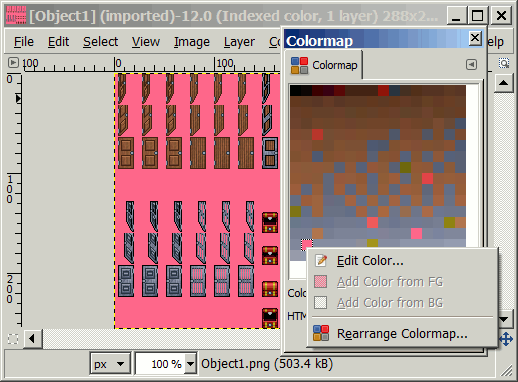
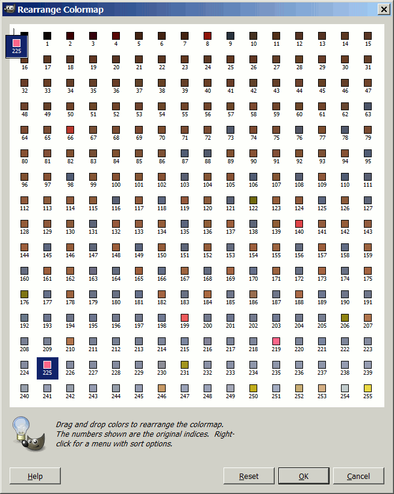

For compatibility with RPG Maker 2000/2003, EasyRPG uses a peculiar 8-bit format for PNGs. The first colour in the palette is considered transparent. So, if your graphics has a different colour arrangement, it might look transparent but won’t.

This is the recommended format to work with the RTP replacement material because people will be able to use your graphics in RPG Maker 2000/2003. Currently, the EasyRPG editor is not finished, so people still have rely to RPG Maker 2000/2003 for creating games to be played in EasyRPG.

## Setting transparency in GIMP

You can use a GIMP graphical editor to set the transparent coloru for your images in a way that is compatible with RPG Maker 2000/2003:

1\. Open the Colourmap window. The colormap lists all the palette entries of the image.

a\. Open Windows → Dockable dialogs → Colormap

b\. The colourmap window will appear. It looks like this:

**N.B.** The colourmap is often called ‘palette’. But in Gimp, a palette is a set of colours that is independent of the image, and colourmap is the set of colours tha that is dependent on the image.

**N.B.** If the Colourmap window says ‘Only indexed images have a colormap’, make the image indexed with Mode → Image → Indexed. Note that if your image has more than 255 colours, some might be lost during the conversion. If you need more colours, you probably shouldn’t use the RPG Maker 2000/2003 image format: EasyRPG supports other formats, so try these.

2\. Identify the transparent colour on the image. In the colormap, there are several pink colours that look like the transparent colour. We need to find out which one is really transparent. The easiest way for this is to use Eyedropper tool.

3\. Try changing the colour that you think is transparent: double-click it and change the colour.

If you’ve changed the colour and the background didn’t change, it means you’ve edited the wrong colour. Undo your colour change (Ctrl+Z) and try again.

If the background colour of the image changes, it means you’ve identified the real transparent colour. In our example, colour 225 is the correct transparent colour:

After you’ve identified the transparent colour, you can revert it to being pink, or change it to a different colour. EasyRPG Player doesn’t care about the exact colour, it’s only for people looking at the image in the editor and in the file manager.

(By the way, you can see that a pixel in the bottom part of some doors is still pink. This is a mistake: the pixel was painted in a slightly different colour of pink, but EasyRPG would consider it a different colour. If you see such stray pixels on your image, this should be fixed.)

4\. After identifying the transparent colour, right-click on the colourmap and choose Rearrange Colourmap.

**N.B.** Make sure there is no selection on your image when you are re-arranging a colourmap. If there is a selection, the colours outside that selection will be swapped.

5\. In the Rearrane Colormap window that will be opened, drag the transparent colour you’ve identified (it’s colour 225 in our example) and drop it at the beginning of the colourmap, before the Colour 0. It will become the new Colour 0 after the re-arrangement. Click OK.

6\. After the re-arrangement is complete, save the image as PNG.

## Setting transparency in RPG Maker 2000/2003

If you have an RPG Maker 2000 or 2003 installed, and the size of your image is standard, you can change the transparent colour of your image by importing it into a RPG Maker 2000/2003 project:

1\. Open any project. You can create a temporary project for this.

2\. Open Tools → Resource Manager in the official translation (or Raw Material Editor in Don Miguel's translation).

3\. Choose the type of the resource you need (e.g. ChipSets).

4\. Choose 'Import Format: PNG (Standard)'.

5\. Click Import.

6\. A window "Select Colour to be Transparent" will be opened. Click on the transparent colour in the image. All the transparent areas will start flashing.

7\. Click OK. The converted image with the correct transparent colour will be stored in the your project folder.
